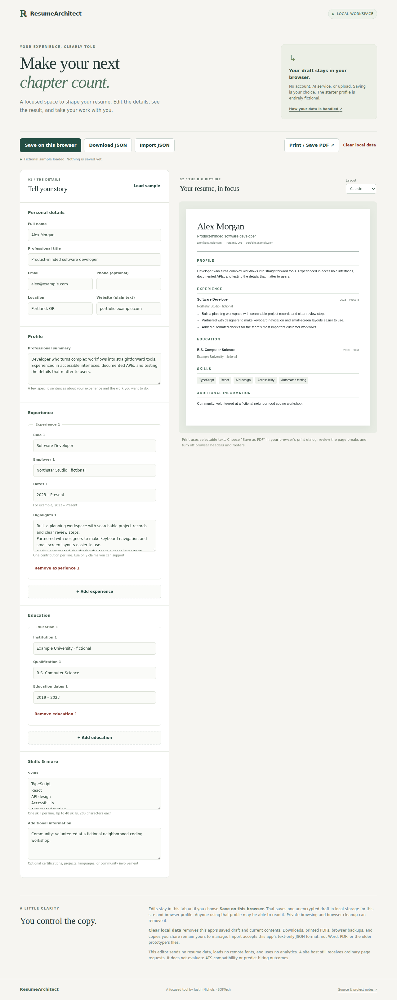

# ResumeArchitect

A focused, local resume workspace by [Justin Nichols](https://github.com/Jnich145) · **[SOFTech Integrations LLC](https://softechintegrations.com/)**. Edit a resume, see its layout, keep a portable copy, and print it with selectable text. The default application needs no account, database, model provider, or API key.



## Try it locally

Use Node **24.21.0** and npm. The lockfile pins the tested dependency graph.

```sh
git clone https://github.com/Jnich145/ResumeArchitect.git
cd ResumeArchitect
npm ci --ignore-scripts
npm run dev
```

Open the loopback address Vite prints, normally `http://127.0.0.1:5173`. The app starts with **Alex Morgan**, an entirely fictional sample. Use **Clear local data** to start blank. No provider credentials or real resume data are needed to evaluate it.

1. Edit contact details, profile, experience, education, skills, and additional information.
2. Switch between **Classic** and **Modern** while watching the live preview.
3. Choose **Save on this browser** to keep one draft across reloads.
4. Use **Download JSON** and **Import JSON** to move the draft between browsers.
5. Choose **Print / Save PDF**, select a paper size, and review page breaks in the browser’s print dialog. Disable browser headers and footers for a clean document.

This is a usable local editor, not a hosted resume service. It does not generate claims about your experience, calculate ATS scores, or predict hiring outcomes.

## What happens to your data

- Editing changes in-memory state. Saving is explicit; there is no autosave or cloud synchronization.
- The saved draft is unencrypted `localStorage` under `resume-architect.document.v1`, scoped to this site’s origin and browser profile. Other users of that profile, browser extensions, or compromised same-origin code may access it. Changing host or port changes the storage origin.
- Clearing local data removes that key and resets the current draft. It does not remove downloaded JSON, PDFs, browser backups, or copies you shared. Browser cleanup or private browsing can also discard storage.
- A blocked/full storage area produces a visible error and leaves file export available. Invalid saved content is not silently overwritten.
- The default app makes no API/model/analytics requests and loads no remote fonts or images. Its production Content Security Policy blocks connections. Initial page/assets still come from your local server or whichever host you choose. External source links open only when clicked.
- Imported files stay local. Imports require the app’s versioned text-only schema, bounded fields/collections, and a maximum size of **128 KiB**. Text is rendered through React escaping; website text is not an active link. This format is not JSON Resume and does not import PDF, Word, or the original prototype’s documents.

Keep exports private, particularly on shared computers. See [the document contract](docs/document-format.md).

## Development and checks

```sh
npm test                 # document validation and storage contracts
npm run build            # strict TypeScript check + production build
npx playwright install chromium
npm run test:e2e         # desktop and 390px browser workflows against dist/
npm run check            # all three checks in order
npm run preview          # serve the built app on loopback
npm audit --omit=dev
```

The browser checks exercise edit → preview → explicit save → reload → JSON export/import → clear; canceled destructive actions and stale-tab save conflicts; corrupt/blocked storage; invalid, oversized and HTML-bearing imports; no external requests; mobile overflow; and multipage PDF generation. CI uses synthetic data and no credentials. [Validation notes](docs/validation.md) distinguish these checks from deployment or customer validation.

The current app has only React/React DOM runtime dependencies. `src/document.ts` owns the portable contract and validation, `src/App.tsx` owns explicit storage/user actions, `src/ResumePage.tsx` renders text, and `src/styles.css` supplies responsive and print layouts. Browser tests run a production preview server using [Playwright’s webServer configuration](https://playwright.dev/docs/test-webserver). [Vite](https://vite.dev/guide/) provides local development and static builds.

## Scope and project history

The original conversational React/Express/MongoDB/AI/Stripe prototype is preserved in [`prototype/`](prototype/README.md), including its source, assets, manifests, documentation, and attribution. It is outside the root build, install, and CI claims. Its existing authentication, billing, build and dependency problems have **not** been repaired by this separation; it should not be deployed with real data. Historical generated coverage and failing screenshots are retained only as legacy artifacts, not current test evidence.

Resume coaches and career programs are a possible audience for a private draft/review workflow. [The opportunity note](docs/opportunity.md) describes the hypothesis and what needs testing before expanding the product. No demand, ATS, or placement claim is established.

No license file was present in the inherited repository. This change preserves that status and does not assign a redistribution license or make new ownership claims over inherited assets.
